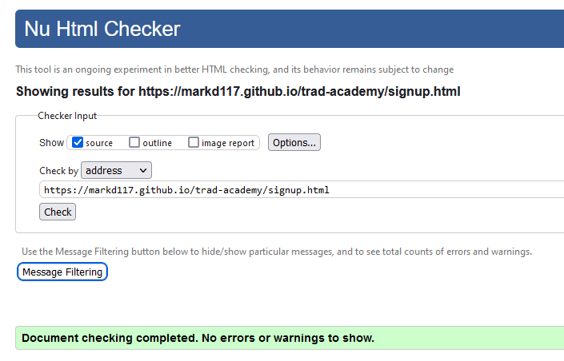
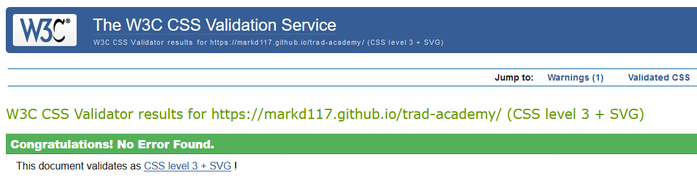

# Trad Academy
Trad Academy is an online resource for a midlands music academy. It is targeted at individuals of all ages and backgrounds who have a keen interest in traditional Irish music. Trad Academy gives it's users an insight into what trad music is all about, tells them about the history, and even shows examples of material. The main purpose is to entice users to sign up for musical lesson programs that are provided by expert tutors from the academy.

The live project can be accessed [here](https://markd117.github.io/trad-academy/)


## Index


## UI/UX 

### Design Overview
For the design of the site, I wanted to go with something that was easy on eyes and simplistic to understand but gives the user all the information they could need. I first hand sketched a prototype of what I initially wanted the site to look like. As I wanted to write decent amount of information, I knew I needed to make a multi-page site. The home page is aimed at anyone who wants to learn a bit more about the company as well as some information about trad music. 

If the user likes what they see, they can delve into the lessons page to learn about traditional Irish instruments in more detail and they can also hear them being played. Both of these pages are structured in a way that allows the user to see what they are reading about with an image, and get more context through the content beside it. The sessions page is aimed at people who are looking for a way of connecting with others through music. the structure of the sessions page is a simple layout of four flip cards which allow the user easy access to finding out where and when sessions take place. 

Finally, the sign up page presents the user with a minimal amount of detail that has to be entered to contact the Trad Academy. The sessions page is structured in a way that allows the user to have quick access to all the information about sessions. Minimal clicks and immediate access is something that I wanted to implement as people can get frustrated if there is too many clicks or too much information to read. This is the same for the sign up page. The user has to enter very minimal information which allows them to have a good user experience.

### Colour Scheme
Due to the nature of most musical instruments being simple in colour, I wanted to replicate this idea with the colour scheme of the website. A warm platinum colour is used for the main body of the site. A jet grey and off-white were used as an alternation of text and background colours which contrasted well against each other. The off-white backgrounds also provide a subtle contrast between content and the platinum body colour. Finally, I used accents of a deep yellow that can be seen in the Trad Academy logo.

- `#E8E8E8` used for body base.
- `#3A3A3A` used for main text & background.
- `#FAFAFA` used for heading texts & backgroud.
- `#EBB42C` used for accents & highlights.

[coolors.co](https://coolors.co/103a55-ffffff-934106-f6ebe0-255c7e-fd9c35) was used to generate this image of the colour pallet below.


### Fonts & Icons
Three separate text fonts were used for the site. All fonts were sourced from [google fonts](https://fonts.google.com/).

- Tenor Sans was used for all headings (Used as it is a rich looking academic font that fits well with the theme of a music academy.)
- Raleway was used for all other text elements (Again, another rich looking academic font that contrasts well with the headings.)
- Open Sans was used for the home page quotes (This font was used to differenciate the quotes from the main body of the site.)
- All icons were sourced from [Font Awesome](https://fontawesome.com/).

## User Stories
- As a new site user, I'd like to understand the site's goal so that I can determine whether it meets my requirements.
- As a new site user, I'd like to see everything that is being offered so that I can make an informed selection.
- As a new site user, I'd like the navigation to be simple and easy to understand.
- As a new site user, I'd like to sign up with as few clicks as possible so that I don't waste my time.
- As a new site user, I'd like to access social media links easily, so that I can learn more about the product.

## Wireframes
During the planning stages, I  created wireframes for all pages of the site. I first did a rough sketch of my initial layout idea and then used [Balsamiq](https://balsamiq.com/wireframes) to design the digital wireframes. All wireframes can be seen below.

### Home Page Wireframes

<details>
<summary>Click to see the Home Page Wireframes</summary>

| Type | Image |
| --- | --- |
| Desktop |  |
| Mobile |  |
| Sketch |  |

</details>

### Lessons Page Wireframes

<details>
<summary>Click to see Lessons Page Wireframes</summary>

| Type | Image |
| --- | --- |
| Desktop |  |
| Mobile |  |
| Sketch |  |

</details>

### Sessions Page Wireframes

<details>
<summary>Click to see the Course Info Section Wireframes</summary>

| Type | Image |
| --- | --- |
| Desktop |  |
| Mobile |  |
| Sketch |  |

</details>

### Sign-Up Page Wireframes

<details>
<summary>Click to see the Flight Support Section Wireframes</summary>

| Type | Image |
| --- | --- |
| Desktop |  |
| Mobile |  |
| Sketch |  |

</details>

### Confirmation Page Wireframes

<details>
<summary>Click to see the Sign-Up Form Section Wireframes</summary>

| Type | Image |
| --- | --- |
| Desktop |  |
| Mobile |  |

</details>

## Features

### Existing Features

#### **Navigation Menu**

* The Trad Academy site is a multi page site with four main accessible pages. These four pages can be easily accessed at the top of the site. The navigation menu is responsive to both mobile and desktop layouts.

- Nav Bar

    - Above 1090px a centered nav bar is displayed at the top of the site with the logo placed to the left. This nav bar is fixed so the user can access it at all time preventing the need to scroll back to the top of the page. There are four options that link to the other pages of the site. The text is jet grey on a platinum background with a good contrast ratio making it easy for the user to see. An underline will appear on the page that the user is currently on. When the user hovers their cursor over a page link, an underline will also appear. Above 1280px the logo will center itself in the space bewteen the left of the nav bar and the links to alleviate a large gap.

        

- Side Menu

    - Below 1090px the navbar options will dissapear and a hamburger icon will appear at the top right of the site navigation. Once clicked a side menu appears from the right of the screen giving the user the same four options that are shown on the nav bar. This side menu is a jet grey box with white text for each of the page links keeping to the style of the alternating white and grey colour pallet. An off-white pill like background will appear on the page link that the user is currently on. The text will also change to grey. Subsequently, when the user hovers over any of the page links, the previously mentioned style will be applied. When the user clicks one of the page options, they will be redirected to that page and the side menu will close. Alternatively, the hamburger icon can be clicked again to close the side menu.

        

#### **Home Page**

- Academy Info Section

    - The Academy info section consists of an image with a title next to relative text. The title is placed in the center of the image and the image has been darkened so that the user can read it clearly. The heading is placed inside the image as the image on its own looked out of place. The heading ties it to the text content continuing the flow of the page. There is a white background placed on the text which again, provides a subtle contrast against the platinum base colour. The academy info section is responsive to both mobile and desktop layouts. This can be seen in the screenshot below.
    
    - Desktop

        
        
    - Mobile
        
        
        
        
- Quotes Section

    - Below the academy info section is the quote section. This section consists of two `blockquotes` styled with the deep yellow accent and italicized font. The quotes are fully responsive and change their size with both mobile and desktop layouts. They provide users interesting insights into Irish music.
    
        

- Site footer

    - At the bottom of the site, the footer consists of four social media links and contact information. The footer is responsive to both mobile and desktop layouts. Below 650px the contact information will stack preventing crowding of elements.
    
    - Desktop

        
        
    - Mobile
        
        

#### **Lessons Page**

- Audio Player & Sign Up Button

    - The sessions page features an audio player that allows the user to listen to the instrument they are reading about. The audio is intuitive for the user and hearing the instrument being played gives the user a positive experience which increases their engagement with the site. The audio feature can be controlled by the user and is muted by default to prevent the audio playing forcibly.

    - If the user decides that they like what they see and hear that my be enticed the click the big shiny sign up button next to the audio player. Once pressed, this button will automatically redirect the user to the sign up page. The sign up button is conveniently placed on every instrument section. If the user decides that they have found their true calling after reading about or listening to any of the instruments, they can instantly go to the sign up page with minimal clicks.
   
        

    - Both of these elements are also responsive. At screen sizes 1200px and below, the sign up button moves below the audio player for the most efficent space layout

        

#### **Sessions Page**

- Sessions Flip Cards

    - The sessions page consists of four flip cards. Images of various bar/trad sesh locations are on the front face of the flip card, as well as the various midlands locations in which the sessions are held. Again, the image is darkened to accentuate the heading and make it clearer for the user. When the user hovers over a card with their cursor, it will rotate 180° and show the back of the flip card. 
    
    - The back of the flip card consists of the location, days and times the particular session of that location is on. This simple but intuitive design is again provides the user with minimal clicks and allows easy access to the information. The cards are also responsive and will change their layout depending on the screen size. Below you can see the front, back, transition and layout of the Session flip cards.

    - The flip cards were inspired by the W3Schools [flip card](https://www.w3schools.com/howto/howto_css_flip_card.asp) how to.

    - Desktop

        
        
    - Mobile
        
        
    
    - Transition

        

- Session Video

    - Below the flip cards is a youtube video embedded with an iframe. The iframe source is set to a video called a [Mad Irish Trad Sesh](https://www.youtube.com/embed/Zn28oeOFfxo). This video demonstrates to the user what a typical Irish trad sessions is really like. The pleasant atmosphere of the video may encourage the user to sign up for lessons or to go to the trad sessions, furher increasing their interativity with the site. The iframe is also responsive to mobile and desktop layouts.

    - Desktop

        
        
    - Mobile
        
        
    
#### **Sign Up Page**

- The sign up page features a form that allows the user to enter their personal details and select an instrument from a drop down menu. The form consists of an heading of 'Let's Get You Playing' with a music icon. There are two text inputs, an email input, a dropdown menu and a submit button (On hover, the submit button text and background colours will reverse.). All of the required input is formatted in a clear and concise manner. There is minimal information for the user to enter to sign up which provides a good user experience. The form has a slightly translucent grey background and is laid on top of a background image. The warm image of the guitar provide the user with a sense of calmness and reassurance whilst signing up. The sign up page is responsive and will change size and location depending on screen size.

- Desktop

    
        
- Mobile
        
    

- Submit Button Hover Effect

     

- Dropdown Menu

    

#### **Confirmation Page**

- Upon clicking the 'Let's Play' submit button for the form on the sign up page, the user will be automatically redirected to the confirmation page which will provide them with a short messaging thanking them for signing up with the Trad Academy. After a period of 10 seconds, the site will automatically return the user to the home page. The user is informed of this process. In the event that they are not brought back to the home page, there is a link that the user can click that will manually return them to the home page. The text for the redirect link is a bright green as it makes it easy to see against the dark background.

    

## Future Features

- Wider Instrument Selection
    - In the future, I would like to add more instruments to the lessons page to broaden the user audience. With a wider selection of instruments, the site becomes more accessible to other groups of people.

- More Instrument Images
    - I would like to add more images to the instrument section and possibly implement a feature that you can scroll through different types of images of the same instruments to get more detailed look.

- Meet the Team page
    - I would like to add a page that shows all of the music tutors, gives a bit of information about them and lets the user see/hear them play. Videos of the tutors introducing themselves and playing music together could also be added.

- More info about Lesson plans
    - I would like to have more information about the lessons. This can include a breakdown of the syllabus, class times, location etc. I would like to implement this to give the user more information about the lessons provided from the Academy.

- User profile
    - I would also like to create a system where a user can create a profile and manage different lessons they want to sign up to

- Payment Method
    - As users will be signing up to various lesson plans, I would like to implement an online payment system so that users can pay for lessons online. This could also add recurring billing if the user continues with the lessons.

## Tools & Technologies Used

- HTML used to create main site content
- CSS used designing and styling the layout of the site
- JavaScript used to implement side-menu for navigation section.
- GitHub used to store site source code.
- GitHub Pages used to deploy the main site
- Gitpod used as a cloud-based IDE for developing the site.

## Testing

### Code Validation

- [HTML W3C Validator](https://validator.w3.org) was used to validate the html code. No errors were found.

    - index.html Validation
   
        

    - lessons.html Validation
    
        

    - sessions.html Validation
   
        

    - signup.html Validation
    
        

    - confirmation.html Validation
    
        


- [CSS Jigsaw Validator](https://jigsaw.w3.org/css-validator) to validate all of my CSS files. No errors were found.

    - style.css Validation
    
        

### Browser Compatibility

- The site has been tested on the following browsers:
    - Google Chrome
    - Mozilla FireFox
    - Microsoft Edge
    - iOS (Mobile)
    - Android

### Testing and Results

#### **Navigation**

| Item | Test | Expected Outcome | Result | 
|--|--|--|--|
| Logo | Clicking site logo | Returns to index.html | pass
| Navbar | Hover & active classes | Show underline | pass
| Home nav link | Click home link | Redirects to home page | pass
| Lessons nav link | Click lessons link | Redirects to lessons page | pass
| Sessions nav link | Click sessions link | Redirects to sessions page | pass
| Sign Up nav link | Click sign up link | Redirects to sign up page | pass
| Nav section | Responsiveness Test 1 | Nav section resizes at 1280px | pass
| Nav section | Responsiveness Test 2 | Nav side menu activates at 1090px | pass
| Side Menu | Clicking hamburger icon | Opens / Closes side menu | pass
| Side Menu | Clicking links | Redirects to other pages | pass
| Side Menu | Hover & active classes | Changes background and text color | pass


#### **Footer**
| Item | Test | Expected Outcome | Result | 
|--|--|--|--|
| Contact info| Changing screen size | contact info stacks below 650px | pass

#### **Home Page**

| Item | Test | Expected Outcome | Result | 
|--|--|--|--|
| Hero image | Resizing screen | Image scales with different screen sizes | pass
| Sub Heading | Resizing screen | Changes location at 1000px | pass
| Academy Info section | Resizing screen | Images and text resize with different screen sizes | pass
| Quote Section | Resizing screen | Quotes resize with different screen sizes | pass

#### **Lessons Page**

| Item | Test | Expected Outcome | Result | 
|--|--|--|--|
| Header image | Resizing screen | Image scales with different screen sizes | pass
| Instruments Info Section | Resizing screen | Images and text scale with different screen sizes | pass
| Audio Player | Playing, pausing, muting audio | controls will function as normally | pass
| Signup Button | Clicking button | Redirects to signup.html | pass
| Signup Button | hover | Swaps text and background colour. Yellow outline appears | pass
| Signup Button & Audio Player | Resizing screen | Above 1200px button moves beside audio player | pass

#### **Sessions Page**

| Item | Test | Expected Outcome | Result | 
|--|--|--|--|
| Header image | Resizing screen | Image scales with different screen sizes | pass
| Flip cards | Resizing screen | Cards change position with different screen sizes | pass
| Flip Cards | Hover Effect | cards will flip showing back information | pass
| Session iframe | Click video | Video plays as normal | pass
| Session iframe | Using controls | Video can be controlled | pass
| Session iframe | Resizing screen | iframe resizes below 1000px | pass
| Session iframe | Resizing screen | iframe resizes below 650px | pass

#### **Sign Up Page**

| Item | Test | Expected Outcome | Result | 
|--|--|--|--|
| Signup Form | Resizing screen | Form resizes with different screen sizes | pass
| Signup Form | Inputting information | Form allows user to enter input | pass
| Signup Form | Submitting blank form | Form requires input before being submitted | pass
| Signup Form | Submitting full form | Form allows to be submitted | pass
| Signup Form | Hover | Changes input border colour to yellow | pass
| Signup Form Submit button | Hover | Swaps text and background colour | pass
| Signup Form Submit button | Click with full form | Redirects to confirmation.html | pass

#### **Confirmation Page**

| Item | Test | Expected Outcome | Result | 
|--|--|--|--|
| Confirmation page text | Resizing screen | Text resizes with different screen sizes | pass
| Confirmation page redirect | Wait 10 seconds after submitting form | Page redirects to index.html | pass
| Confirmation page link | Click redirect link | Link redirects to index.html | pass

## Bug Fixes

- There was a bug with all hero and header images. While the page was being resized, The hero/header images were set to change at 1000px. This caused gaps at both sides of the image.

    

    - This bug was fixed by creating a media query `@media screen and (min-width: 820px)` and setting the images to change at 820px as that was the breaking point.

- Assigning `user-input` class on `select` form element, caused the height of the element to shrink.

     

    - This bug was fixed by giving the `select` element its own css style that gave it a height of `27px` and allowed the text to be centered.

- Contact info separation too wide. At larger screen sizes, the contact info spreads put very wide.

    

    

    - This bug was fixed by adding a `350px` margin to each side of the contact container. Once the contact information start to get close, they spread out again.

## Known Bugs

- There is a bug on iOS that causes an error when loading the audio

    

    

    - The audio showed as 00:00 and was unable to play in the format below:
        ``` HTML
            <div class="audio-signup-container">
                <audio controls muted>
                    <p>
                        Your browser does not support this audio. Click <a
                        href="assets/audio/guitaraudio.mp3" download>here</a> to download the audio!
                    </p>
                    <source src="assets/audio/banjoaudio.mp3" type="audio/mpeg">
                </audio>
                <a href="signup.html" class="signup-button signup-mobile-position">Sign Up</a>
            </div>
         ```

         I removed the source element as per a conversation with my mentor. After that was removed, the audio showed as error.

         ``` HTML
            <div class="audio-signup-container">
                <audio src="assets/audio/guitaraudio.mp3" controls muted>
                    <p>
                        Your browser does not support this audio. Click <a
                        href="assets/audio/guitaraudio.mp3" download>here</a> to download the audio!
                    </p>
                </audio>
                <a href="signup.html" class="signup-button signup-mobile-position">Sign Up</a>
            </div>
        ```
        Interestingly enough, the piano audio works fine (Code shown below). I believe it may have something to do with the audio files themselves however it is odd as the audio works fine on browsers as well as on android.

        ``` HTML
            <div class="audio-signup-container">
                <audio src="assets/audio/pianoaudio.mp3" controls muted>
                    <p>
                        Your browser does not support this audio. Click <a
                        href="assets/audio/pianoaudio.mp3" download>here</a> to download the audio!
                    </p>
                </audio>
                <a href="signup.html" class="signup-button signup-mobile-position">Sign Up</a>
            </div>
        ```

## Deployment


## Credits


