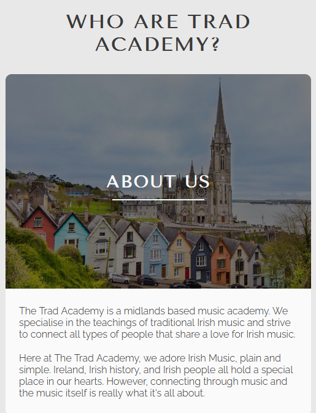

# Trad Academy
Trad Academy is an online resource for a midlands music academy. It is targeted at individuals of all ages and backgrounds who have a keen interest in traditional Irish music. Trad Academy gives it's users an insight into what trad music is all about, tells them about the history, and even shows examples of material. The main purpose is to entice users to sign up for musical lesson programs that are provided by expert tutors from the academy.

The live project can be accessed [here](https://markd117.github.io/trad-academy/)

## Index

## UI/UX 

### Design Overview
For the design of the site, I wanted to go with something that was easy on eyes and simplistic to understand but gives the user all the information they could need. I first hand sketched a prototype of what I initially wanted the site to look like. As I wanted to write decent amount of information, I knew I needed to make a multi-page site. The home page is aimed at anyone who wants to learn a bit more about the company as well as some information about trad music. 

If the user likes what they see, they can delve into the lessons page to learn about traditional Irish instruments in more detail and they can also hear them being played. Both of these pages are structured in a way that allows the user to see what they are reading about with an image, and get more context through the content beside it. The sessions page is aimed at people who are looking for a way of connecting with others through music. the structure of the sessions page is a simple layout of four flip cards which allow the user easy access to finding out where and when sessions take place. 

Finally, the sign up page presents the user with a minimal amount of detail that has to be entered to contact the Trad Academy. The sessions page is structured in a way that allows the user to have quick access to all the information about sessions. Minimal clicks and immediate access is something that I wanted to implement as people can get frustrated if there is too many clicks or too much information to read. This is the same for the sign up page. The user has to enter very minimal information which allows them to have a good user experience.

### Colour Scheme
Due to the nature of most musical instruments being simple in colour, I wanted to replicate this idea with the colour scheme of the website. A warm platinum colour is used for the main body of the site. A jet grey and off-white were used as an alternation of text and background colours which contrasted well against each other. The off-white backgrounds also provide a subtle contrast between content and the platinum body colour. Finally, I used accents of a deep yellow that can be seen in the Trad Academy logo.

- `#E8E8E8` used for body base.
- `#3A3A3A` used for main text & background.
- `#FAFAFA` used for heading texts & backgroud.
- `#EBB42C` used for accents & highlights.

[coolors.co](https://coolors.co/103a55-ffffff-934106-f6ebe0-255c7e-fd9c35) was used to generate this image of the colour pallet below.

### Fonts & Icons
Three separate text fonts were used for the site. All fonts were sourced from [google fonts](https://fonts.google.com/).

- Tenor Sans was used for all headings (Used as it is a rich looking academic font that fits well with the theme of a music academy.)
- Raleway was used for all other text elements (Again, another rich looking academic font that contrasts well with the headings.)
- Open Sans was used for the home page quotes (This font was used to differenciate the quotes from the main body of the site.)
- All icons were sourced from [Font Awesome](https://fontawesome.com/).

## User Stories
- As a new site user, I'd like to understand the site's goal so that I can determine whether it meets my requirements.
- As a new site user, I'd like to see everything that is being offered so that I can make an informed selection.
- As a new site user, I'd like the navigation to be simple and easy to understand.
- As a new site user, I'd like to sign up with as few clicks as possible so that I don't waste my time.
- As a new site user, I'd like to access social media links easily, so that I can learn more about the product.

## Wireframes
During the planning stages, I  created wireframes for all pages of the site. I first did a rough sketch of my initial layout idea and then used [Balsamiq](https://balsamiq.com/wireframes) to design the digital wireframes. All wireframes can be seen below.

### Home Page Wireframes

Click to see the Home Page Wireframes

| Type | Image |
| --- | --- |
| Desktop |  |
| Mobile |  |
| Sketch |  |

### Lessons Page Wireframes

Click to see Lessons Page Wireframes

| Type | Image |
| --- | --- |
| Desktop |  |
| Mobile |  |
| Sketch |  |

### Sessions Page Wireframes

Click to see the Course Info Section Wireframes

| Type | Image |
| --- | --- |
| Desktop |  |
| Mobile |  |
| Sketch |  |

### Sign-Up Page Wireframes

Click to see the Flight Support Section Wireframes

| Type | Image |
| --- | --- |
| Desktop |  |
| Mobile |  |
| Sketch |  |

### Confirmation Page Wireframes

Click to see the Sign-Up Form Section Wireframes

| Type | Image |
| --- | --- |
| Desktop |  |
| Mobile |  |

## Features

### Existing Features

#### **Navigation Menu**

* The Trad Academy site is a multi page site with four main accessible pages. These four pages can be easily accessed at the top of the site. The navigation menu is responsive to both mobile and desktop layouts.

- Nav Bar

    - Above 1090px a centered nav bar is displayed at the top of the site with the logo placed to the left. This nav bar is fixed so the user can access it at all time preventing the need to scroll back to the top of the page. There are four options that link to the other pages of the site. The text is jet grey on a platinum background with a good contrast ratio making it easy for the user to see. An underline will appear on the page that the user is currently on. When the user hovers their cursor over a page link, an underline will also appear. Above 1280px the logo will center itself in the space bewteen the left of the nav bar and the links to alleviate a large gap.

        

- Side Menu

    - Below 1090px the navbar options will dissapear and a hamburger icon will appear at the top right of the site navigation. Once clicked a side menu appears from the right of the screen giving the user the same four options that are shown on the nav bar. This side menu is a jet grey box with white text for each of the page links keeping to the style of the alternating white and grey colour pallet. An off-white pill like background will appear on the page link that the user is currently on. The text will also change to grey. Subsequently, when the user hovers over any of the page links, the previously mentioned style will be applied. When the user clicks one of the page options, they will be redirected to that page and the side menu will close. Alternatively, the hamburger icon can be clicked again to close the side menu.

        

#### **Home Page**

- Academy Info Section

    - The Academy info section consists of an image with a title next to relative text. The title is placed in the center of the image and the image has been darkened so that the user can read it clearly. The heading is placed inside the image as the image on its own looked out of place. The heading ties it to the text content continuing the flow of the page. There is a white background placed on the text which again, provides a subtle contrast against the platinum base colour. The academy info section is responsive to both mobile and desktop layouts. This can be seen in the screenshot below.
    
    - Desktop

        
        
    - Mobile
        
        
        
        
- Quotes Section

    - Below the academy info section is the quote section. This section consists of two `blockquotes` styled with the deep yellow accent. The quotes are fully responsive and change their size with both mobile and desktop layouts. They provide users interesting insights into Irish music.
    
        

- Site footer

    - At the bottom of the site there is the site footer. The footer consists of four social media links and contact information. The footer is responsive to both mobile and desktop layouts. Below 650px the contact information will stack preventing crowding of elements.
    
    - Desktop

        
        
    - Mobile
        
        
        

## Testing

## Deployment

## Credits

## Future Features